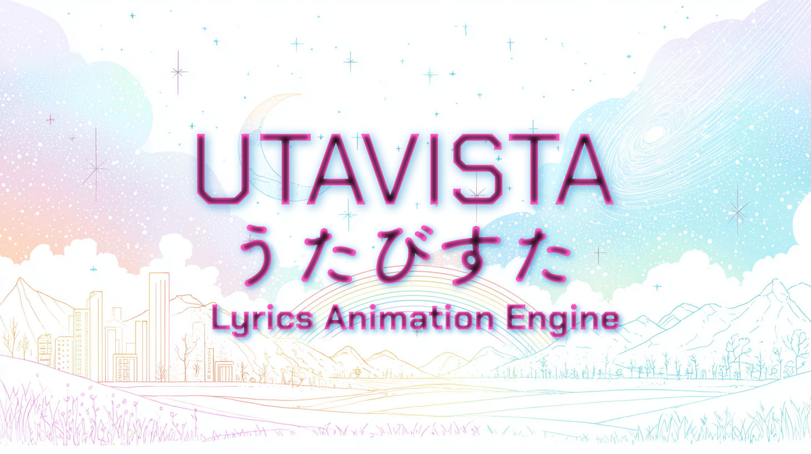

# UTAVISTA



UTAVISTA（うたびすた）v0.6.0は、歌詞アニメーション動画を作成するためのElectronベースのデスクトップアプリケーションです。カラオケスタイルのテキストアニメーションをテンプレートベースで簡単に作成し、高品質な動画として出力できます。

## アプリケーション名について

「UTAVISTA」は「歌（UTA）」と「眺望（VISTA）」を組み合わせた造語です。歌の持つイメージや感情を視覚的に表現し、聴き手に新しい音楽体験を提供することを目指しています。

## ⚠️ 開発段階について

**本アプリケーションは現在プレベータ版（Pre-Beta）段階です。**

- 機能の実装や仕様が未完成の部分があります
- 動作の安定性に問題がある可能性があります
- ユーザーインターフェースの統一性やスタイルが不完全です
- 予期しない不具合やデータ損失が発生する可能性があります
- 機能仕様や操作方法が予告なく変更される場合があります

**今後のバージョンアップでは以下の改善を予定しています：**
- UIのスタイル統一や使いやすさの向上
- テンプレート機能の拡充と関連機能の改善
- 上記に付随する問題点の修正

本アプリケーションの使用は**完全に自己責任**でお願いいたします。重要なデータは事前にバックアップを取り、十分にテストを行った上でご利用ください。

興味をお持ちいただき、開発段階でのフィードバックをいただける方のご協力をお待ちしております。

## 機能

- 階層的なタイムライン編集（フレーズ、単語、文字単位）
- **歌詞編集機能**（テキスト・タイミング・フレーズ管理、単語マージ機能）
- テンプレートベースのアニメーションシステム
- リアルタイムプレビュー（PIXI.js WebGL レンダリング）
- 高品質な動画エクスポート（WebCodecs使用）
- **背景動画機能**（自動ループレンダリング対応）
- **柔軟な出力範囲設定**（全区間・指定時間範囲の選択出力）
- カスタマイズ可能なテンプレートパラメータ
- 音声ファイル対応とタイミング同期
- プロジェクトファイル保存・読み込み機能

## 更新履歴

### v0.5.1 (2025-08-23)

#### 新機能
- **Twinkle効果の強化**: SparkleEffectPrimitiveのパーティクルに瞬き効果を追加
  - 明暗のコントラストによる視覚的な瞬き表現
  - デフォルトで有効化（80%の確率で瞬き）
  - 頻度とタイミングの最適化

- **SparkleEffectPrimitive**: 決定論的パーティクルシステムの実装
  - 単語スライドテキストに文字の移動に伴い星型パーティクルを生成する機能を実装
  - 星の頂点数、移動速度に対する感度などパラメータで調整可能

- **パフォーマンス最適化**: レンダリングキャッシュとビューポートベース更新

#### 実験的機能（未統合）
- **ビート検出システム**: 音楽のリズムに同期したアニメーション制御（実装済み・統合準備中）
  - BeatDetector: オンセット検出アルゴリズム
  - AudioAnalyzer: FFT解析と音声処理
  - BeatManager: ビートイベント管理

#### 改善
- パーティクルエフェクトのデフォルトパラメータ最適化
- Twinkle効果のalpha値処理を改善（オーバーフロー問題の修正）

#### バグ修正
- Twinkle効果が表示されない問題を修正
- パーティクルの縮小エフェクトとTwinkle効果の競合を解消


## インストール方法

### 必要な環境

- Node.js 18以上
- npm
- Electron対応OS（Windows、macOS、Linux）

### セットアップ

1. リポジトリをクローン
```bash
git clone https://github.com/sousakujikken/utavista.git
cd utavista
```

2. 依存関係をインストール
```bash
npm install
```

3. アプリケーションをビルド
```bash
npm run build
```

## 起動方法

### 開発モードでの起動

開発時は以下の2つのコマンドを**それぞれ別のターミナル**で実行します：

1. **開発用ビルドプロセスの起動**
```bash
npm run dev
```
このコマンドでRenderer（UI）の開発サーバーとMain（Electron）プロセスのビルド（watch mode）が並行実行されます。

2. **Electronアプリケーションの起動**

別のターミナルで下記のコマンドを実行してElectronアプリケーションを起動します。
```bash
npm run electron
```

### アプリケーションのパッケージ化（未検証）

```bash
npm run package      # 現在のプラットフォーム用
npm run package:all  # 全プラットフォーム用（Windows、macOS、Linux）
```

## 使い方

### 基本的な操作手順

1. **アプリケーションの起動**
   - Electronアプリケーションを起動すると、メインウィンドウが表示されます

2. **音声ファイルの読み込み**
   - 「音楽」タブから音声ファイル（MP3、WAVなど）をドラッグ&ドロップまたは選択
   - 波形が表示され、再生コントロールが利用可能になります

3. **歌詞の入力と編集**
   - 別途作成した歌詞ファイルを「歌詞」タブからJSONファイル読み込みボタンで読み込み
   - 「歌詞を編集」ボタンから歌詞エディタを開き、歌詞データを直接編集可能
   - 歌詞エディタでは以下の操作が可能：
     - フレーズテキストの編集（クリックで編集モード）
     - 開始・終了時刻の調整（ミリ秒単位）
     - フレーズの削除
     - 変更内容のリアルタイム反映とプロジェクト保存

### 歌詞データについて

歌詞データの詳細な仕様については、[docs/lyricsdata_format.md](./docs/lyricsdata_format.md) を参照してください。

#### 歌詞データの作成方法

正確なタイミング情報を含む歌詞データを作成するには、以下の方法を推奨します：

1. **音声ファイルの準備**
   - 対象楽曲のボーカルトラックをSTEM分離ツールで抽出
   - ボーカルのみの音声ファイルを準備

2. **LLMを使用した歌詞データ生成**
   - Gemini 2.5 proなどのマルチモーダル対応LLMを使用
   - 以下のデータをLLMに提供：
     - ボーカルトラックの音声ファイル
     - 歌詞のテキストデータ
     - `src/renderer/data/testLyrics.json` をサンプルとして提示
   - LLMに対してUTAVISTA形式の歌詞データ生成を依頼

この手法により、フレーズ・単語・文字レベルでの精密なタイミング情報を含む歌詞データを効率的に作成できます。

4. **タイミングの設定**
   - タイムライン上でフレーズマーカーをドラッグして開始/終了時間を調整
   - 階層構造（フレーズ→単語→文字）でより細かいタイミング制御が可能

5. **テンプレートの適用**
   - 「テンプレート」タブでアニメーションテンプレートを選択
   - 選択したフレーズまたは全フレーズにテンプレートを適用

6. **パラメータの調整**
   - パラメータエディタで各テンプレートの詳細設定を調整
   - リアルタイムプレビューで即座に結果を確認

### 個別オブジェクトのパラメータアクティベーション機能

うたびすたでは、グローバル設定とは別に、個別のフレーズ・単語・文字に独自のパラメータを設定できます。この機能には「アクティベーション」という仕組みがあり、明示的にアクティブ化されたオブジェクトのみが個別設定を優先的に使用します。

#### アクティベーションの使い方

1. **個別オブジェクトの選択**
   - タイムライン上でフレーズ、単語、または文字マーカーをクリックして選択
   - 複数選択も可能（Shift+クリックまたはCtrl/Cmd+クリック）

2. **テンプレートタブでの設定**
   - 「選択オブジェクト設定」モードに切り替え
   - 「アクティブ化」ボタンをクリックして、選択したオブジェクトをアクティブ化
   - アクティブ化されたオブジェクトは**緑色のマーカー**で表示される

3. **個別パラメータの編集**
   - アクティブ化後、パラメータエディタで個別の設定を調整
   - これらの設定はグローバル設定より優先される

4. **アクティベーションの解除**
   - 「アクティブ化解除」ボタンで個別設定を無効化
   - 解除すると、そのオブジェクトはグローバル設定を使用するようになる

#### 使用上の注意事項

1. **優先順位の理解**
   - アクティブ化されていないオブジェクト → **グローバル設定**が適用
   - アクティブ化されたオブジェクト → **個別設定**が優先

2. **個別設定の保持**
   - アクティブ化を解除しても、個別パラメータの値は保持される
   - 再度アクティブ化すると、以前の個別設定が復活する

3. **視覚的な確認**
   - タイムラインマーカーの色で状態を確認：
     - **通常色**：グローバル設定を使用
     - **緑色**：アクティブ化済み（個別設定を使用）

4. **一括管理機能**
   - 「全個別設定を強制クリア」：すべてのアクティベーションと個別設定を削除
   - プロジェクトが複雑になった場合のリセット用

5. **パフォーマンスへの配慮**
   - 多数のオブジェクトを個別にアクティブ化すると、管理が複雑になる
   - 必要な部分のみアクティブ化することを推奨

#### 活用例

- **特定フレーズの強調**：サビ部分のみフォントサイズを大きくする
- **色の変化**：特定の単語だけ異なる色にする
- **アニメーション速度の調整**：重要な歌詞はゆっくり表示する

この機能により、統一感を保ちながら、部分的に個性的な演出を加えることができます。

7. **動画のエクスポート**
   - 「エクスポート」タブで解像度、フレームレート、品質を設定
   - **出力範囲の選択**：
     - 「選択区間を出力」チェックボックスで全区間 or 指定範囲を選択
     - チェック時は開始時間・終了時間を「MM:SS.mmm」形式で指定可能
     - 部分的なプレビューや特定シーンの抽出に便利
   - 「エクスポート開始」で動画ファイルを生成・保存

### プロジェクトファイルの管理

- **保存**: 「保存」タブまたはCtrl/Cmd + S でプロジェクトを保存（.uta形式）
- **開く**: ファイルメニューまたはドラッグ&ドロップで既存プロジェクトを開く
- **自動保存**: 作業中の変更は自動的に保存されます
- **エクスポート**: プロジェクトデータのJSONエクスポート機能

## テンプレート開発

新しいアニメーションテンプレートを作成する場合は、以下のドキュメントを参照してください：

📚 **テンプレート実装ガイド**: `/docs/template-implementation-guide.md`

このガイドには以下の内容が含まれています：
- テンプレートの基本構造
- 階層アニメーションモデルの説明
- 実装に必要なメソッドの詳細
- サンプルコード

## プロジェクト構造

```
utavista/
├── src/
│   ├── components/    # UIコンポーネント
│   ├── engine/        # アニメーションエンジン
│   ├── templates/     # アニメーションテンプレート
│   ├── types/         # TypeScript型定義
│   └── export/        # 動画エクスポート機能
├── docs/             # ドキュメント
└── public/           # 静的ファイル
```

## 開発コマンド

```bash
npm run dev              # 開発モード起動（Renderer + Main）
npm run dev:renderer     # Rendererプロセスのみ開発モード
npm run dev:main         # Mainプロセスのみビルド（watch）
npm run build            # プロダクションビルド
npm run build:renderer   # Rendererプロセスビルド
npm run build:main       # Mainプロセスビルド
npm run lint             # ESLintの実行
npm run electron         # Electronアプリ起動
npm run package          # アプリパッケージ化
npm run package:all      # 全プラットフォーム向けパッケージ化
```

## ライセンス

### デュアルライセンス構造

UTAVISTAは以下のデュアルライセンス構造を採用しています：

- **メインアプリケーション**: GNU General Public License v3.0 (GPL-3.0)
- **アニメーションテンプレート**: Creative Commons Attribution 4.0 International (CC-BY-4.0)

詳細は以下のファイルを参照してください：
- [LICENSE.txt](./LICENSE.txt) - GPL-3.0ライセンス全文
- [LICENSE-CC-BY-4.0.txt](./LICENSE-CC-BY-4.0.txt) - CC-BY-4.0ライセンス概要
- [LICENSE-TEMPLATES.md](./LICENSE-TEMPLATES.md) - テンプレートライセンスの詳細説明

### GPL-3.0 ライセンスについて

- このソフトウェアを自由に使用、研究、共有、改変することができます
- 改変版を配布する場合は、同じGPL-3.0ライセンスを適用する必要があります
- 商用利用も可能ですが、ソースコードの開示が必要です

### CC-BY-4.0 テンプレートについて

一部のアニメーションテンプレート（MultiLineText、FlickerFadeTemplate、GlitchText、WordSlideText）は
CC-BY-4.0でライセンスされており、適切なクレジット表記により自由に使用・改変できます。

Copyright (C) 2025 UTAVISTA Project

This program is free software: you can redistribute it and/or modify
it under the terms of the GNU General Public License as published by
the Free Software Foundation, either version 3 of the License, or
(at your option) any later version.

## 開発履歴

### v0.1.0 (初期リリース - アルファ版)
- 基本的な歌詞アニメーション機能の実装
- テンプレートベースのアニメーションシステム構築
- タイムライン編集機能の基礎実装
- PIXI.jsを用いたWebGLレンダリング基盤の確立
- 基本的な動画エクスポート機能
- プロジェクトファイルの保存・読み込み機能

### v0.4.0 (プレベータ版)
- 歌詞編集機能の大幅な拡充
- 個別オブジェクトパラメータアクティベーション機能の実装
- 出力範囲選択機能の追加（全区間・指定時間範囲）
- タイムライン表示とUI操作性の改善
- テンプレートシステムの安定化
- 階層的なマーカー表示機能の充実
- プロジェクト状態管理の改善

### v0.4.1 (プレベータ版)
- フォント選択機能の改善
- エンジン安定性の向上
- 歌詞パネルとコンテンツタブのUI/UX改善
- パッケージ依存関係の更新

### v0.4.2 (プレベータ版)
- テンプレートパラメータ処理の改善
- 自動スクロール機能の修正
- UI表示の安定化
- コードの最適化とバグ修正

### v0.4.3 (プレベータ版)
- **新しいParameterRegistryシステムの導入**
  - パラメータの一元管理によりパラメータ乱造問題を解決
  - 型安全性を強化した集中パラメータ検証システム
  - コンパイル時＋実行時の二重チェック機能
- **開発効率向上のためのツール追加**
  - `npm run validate-parameters`: パラメータ整合性の自動チェック
  - `npm run pre-commit`: コミット前の自動検証
  - 包括的なパラメータ管理ガイドライン文書
- **アーキテクチャの改善**
  - WordSlideText/WordSlideText2を基準とした標準パラメータの統一
  - テンプレート固有パラメータの厳密な型定義
  - レガシー`getParameterConfig()`からレジストリベースシステムへの移行
- **ドキュメントの充実**
  - テンプレート実装ガイドの大幅更新
  - 新しいパラメータ管理システムの詳細解説
  - 開発フローの標準化

### v0.5.0 (プレベータ版)
- **背景動画機能の実装**
  - 背景動画の自動ループレンダリング機能を追加
  - 動画出力時の背景動画統合機能
- **音楽ファイル制御の強化**
  - 音楽ファイル時間オフセット機能の実装
  - 音楽ファイル読み込み時の波形リフレッシュ機能改善
- **歌詞編集機能の拡充**
  - 単語マージ機能の実装
  - 歌詞編集システムの安定性向上
- **アニメーション機能の強化**
  - Y方向動的オフセット機能のアクティブ化
  - 単語スライドテキストのランダム化機能改善
- **システム安定性の向上**
  - 自動保存からの復元機能改善
  - 未登録テンプレートのフォールバック機能実装
  - 指定時間動画出力の音楽時間範囲問題修正

### v0.5.1 (プレベータ版)
- **SparkleEffectPrimitive（パーティクルシステム）の実装**
  - 決定論的パーティクル生成システム
  - 文字移動速度に連動したパーティクル生成
  - サイズ縮小エフェクトの実装
- **Twinkle効果の実装と強化**
  - SparkleEffectPrimitiveに瞬き効果を追加
  - 明暗コントラストによる視覚的な瞬き表現
  - デフォルトパラメータの最適化（有効化、確率80%、頻度1.0回/秒）
- **実験的機能（未統合）**
  - ビート検出システム（BeatDetector、AudioAnalyzer、BeatManager）の実装
  - 音楽リズムに同期したアニメーション制御の基盤構築
- **バグ修正と改善**
  - Twinkle効果が表示されない問題を修正
  - パーティクルのalpha値オーバーフロー問題を解決
  - 縮小エフェクトとTwinkle効果の競合を解消
  - ドキュメントの更新と整備

### v0.6.0 (現在のバージョン - プレベータ版)
- **リポジトリ履歴のクリーンアップ**
  - 53個のコミットを統合し、整理された開発履歴を実現
  - 不要なテスト・開発ファイルの削除
  - クリーンな開発基盤の構築
- **ドキュメント整理**
  - 包括的なドキュメント構成の改善
  - テンプレート実装ガイドの充実
  - API仕様書の統合と更新
- **開発体制の最適化**
  - バージョン管理システムの統一
  - 開発ワークフローの標準化

## 貢献

プルリクエストを歓迎します。大きな変更を行う場合は、まずissueを作成して変更内容について議論してください。


## サポート

問題が発生した場合は、GitHubのissueセクションで報告してください。